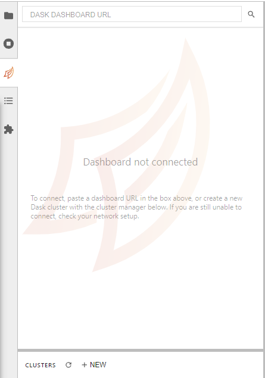
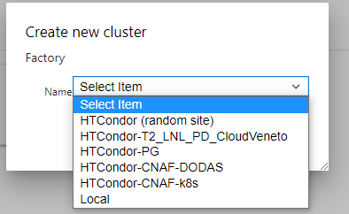
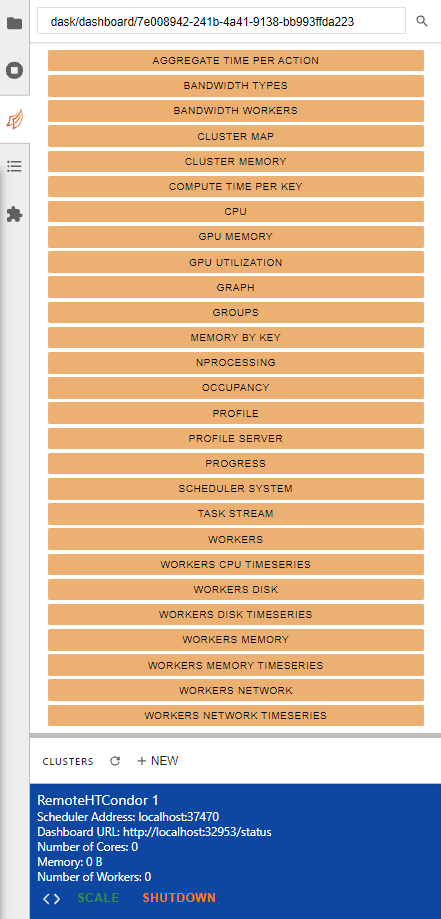

# Analysis Examples
This repo contains some examples of analysis performed on the Analysis Facility using RDataFrame distributed on Dask on top of HTCondor

## How to access analysis facility
- Go to [https://jhub.131.154.96.124.myip.cloud.infn.it/](https://jhub.131.154.96.124.myip.cloud.infn.it/)
- Login using the CMS INDIGO IAM service with CERN SSO (https://cms-auth.web.cern.ch/login)
- Choose the JupyterLab image (in order to be able to use distribution on Dask on top of HTCondor, use the suggested one) and set memory and CPU

## Usage of RDataFrame distributed on Dask, on top of HTCondor
- Open a a new Python3 notebook
- Deploy a Dask cluster on HTCondor. This can be done via the Dask JupyterLab plugin:
  - click on ```+new``` button:
  
    
    
  - choose where to deploy the cluster:
  
    
    
  - and wait for the scheduler to start to run. The interface will contain all info about the cluster and three buttons for setting up a client, scaling and shutdown:

    

- Once deployed, initialize the Dask client: pushing ```<>``` setup automatically a cell to do this, that will look like this:
  ```
  from dask.distributed import Client

  client = Client("localhost:37470")
  client
  ```
  
- Insert the declaration of your custom functions inside an initialization function:
  ```
  import ROOT
  
  text_file = open("postselection.h", "r")
  data = text_file.read()
  distributed = ROOT.RDF.Experimental.Distributed

  def my_initialization_function():
      ROOT.gInterpreter.Declare('{}'.format(data))
    
  distributed.initialize(my_initialization_function)
  ```
- Create a distributed RDataFrame reading a list of samples:
  ```
  chain = [<path to 1st .root file>, <path to 2nd .root file>, ...]

  df = ROOT.RDF.Experimental.Distributed.Dask.RDataFrame("<name of tree>",
                chain,
                npartitions=<number of partitions>,
                daskclient=client)
  ```

## Minimal example
[Here](notebooks/MinimalExample.ipynb) you can find a simple notebook where a very simple distributed RDataFrame analysis is run on a small OpenData sample using a Dask deployment on HTCondor.
